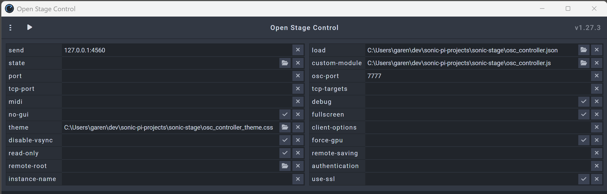

# Sonic Stage Project

Sonic Stage is an integrated music and visual performance system that combines Sonic Pi for audio generation, Open Stage Control for user interface, and optionally Processing for real-time visualizations.

## Features
- Real-time audio generation and playback
- Configurable instruments and effects
- MIDI input support for live performance
- Visual animations synchronized with music (optional)
- OSC (Open Sound Control) communication between components

## Requirements

### Software
1. **Sonic Pi** (v3.3.0 or higher): [Download Sonic Pi](https://sonic-pi.net/)
2. **Open Stage Control**: [Download Open Stage Control](https://openstagecontrol.ammd.net/)
3. **Processing** (v4.0 or higher, optional): [Download Processing](https://processing.org/)

### Libraries
For Processing (optional):
- `oscP5` (for OSC communication)
- `controlP5` (for UI elements)

## Installation

### Step 1: Clone the Repository
Clone the `sonic-stage` repository to your local machine:
```bash
git clone https://github.com/garenhart/sonic-stage
```

### Step 2: Install Sonic Pi
1. Download and install Sonic Pi from the [official website](https://sonic-pi.net/).
2. Open Sonic Pi and ensure it runs correctly.

### Step 3: Install Open Stage Control
1. Download Open Stage Control from the [official website](https://openstagecontrol.ammd.net/).
2. Extract the downloaded files to a convenient location.

### Step 4: Install Processing (Optional)
If you want to enable visualizations:
1. Download Processing from the [official website](https://processing.org/).
2. Install the required libraries:
   - Open Processing.
   - Go to `Sketch > Import Library > Add Library (or Manage Libraries)`.
   - Search for `oscP5` and `controlP5` and install them.

## Configuration

### Directory Structure
The project is organized as follows:
```
sonic-stage/
  sonic-stage.rb       # Wrapper script to launch main script (avoids buffer overflow)
  osc_monitor.rb       # Main Sonic Pi script
  osc_controller.json  # Open Stage Control configuration
  config/              # JSON configuration files for music arrangements
  lib/                 # Ruby libraries for Sonic Pi
```

### Step 1: Configure Open Stage Control
1. Start the Open Stage Control executable.
2. Modify the following fields in the interface:
   - **send**: Set this to `<your-local-ip>:4560` (Sonic Pi incoming port for OSC communication, replace `<your-local-ip>` with your machine's local IP address, e.g., `127.0.0.1`).
   - **load**: Select the `osc_controller.json` file from the project directory.
   - **custom-module**: Specify the path to `osc_controller.js` from the project directory.
   - **osc-port**: Set this to `7777` (or your desired port for the incoming OSC messages).
   - **theme**: Select the `osc_controller_theme.css` file from the project directory.
   

### Step 2: Configure Processing (Optional)
If you are using Processing for visualizations:
1. Open one of the Processing sketches (e.g., `keyboard_and_drums/keyboard_and_drums.pde`).
2. Update the OSC port (if desired) by modifying the `oscP5 = new OscP5(this, 8000);` line in the sketch.

### Step 3: Configure Sonic Pi
#### Substep 3a: Configure osc_monitor.rb
1. Open the `osc_monitor.rb` in Sonic Pi or your preferred text editor.
2. Update the `lib_path` and `config_path` variables if necessary to match your local directory structure.
3. Update the 'ctrl_ip' and 'ctrl_port' variables to match the Open Stage Control configuration.
4. If using Processing, update the 'anim_ip' and 'anim_port' variables to match the Processing configuration.
5. Save the changes.

#### Substep 3b: Configure sonic-stage.rb
1. Open the `sonic-stage.rb` in Sonic Pi or your preferred text editor.
2. Update the run_file statement to match your local directory structure.
3. Save the changes.

### Communication Flow
```
Open Stage Control (UI) <---OSC---> Sonic Pi (Audio) <---OSC---> Processing (Visual, optional)
      (Port 7777)                     (Port 4560)                   (Port 8000)
```

### Usage
1. Use the Open Stage Control interface to adjust music parameters in real-time.
2. Sonic Pi generates audio based on the configuration.
3. (Optional) If Processing is running, it visualizes the music in real-time.

### Execution Steps

#### Step 1: Launch Open Stage Control
1. Launch the Open Stage Control executable (open-stage-control.exe).
2. Click the "play" button near the top left of the window. You should see status messages in the launcher window such as:
   ```
   (INFO) Server started, app available at
       http://127. . . :8080
       http://your.ip.address:8080
   ```
   And a client window will open. You can also copy the URL and paste it into your browser which will open the client window in your browser.

#### Step 2: Run Processing Sketch (Optional)
If you want visualizations:
1. Open one of the Processing sketches (e.g., `keyboard_and_drums/keyboard_and_drums.pde`).
2. Run the sketch to start the visualization.

#### Step 3: Start Sonic Pi
1. Open Sonic Pi and load the `sonic-stage.rb` file.
2. Ensure that Open Stage Control (and optionally Processing) are already running.
3. Run the code in Sonic Pi to start generating audio and communicating via OSC messages with Open Source Control (and optionally with Processing).

## Troubleshooting
- **Port Conflicts**: Ensure no other applications are using ports `7777` or `8000`.
- **Missing Libraries**: Verify that `oscP5` and `controlP5` are installed in Processing (if using Processing).
- **Configuration Errors**: Double-check the paths in `sonic-stage.rb`, 'osc_monitor.rb' and `osc_controller.json`.
- **Latency Issues**: Run all components on the same machine for minimal latency.

## License
This project is licensed under the MIT License.