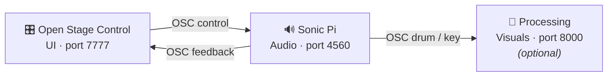
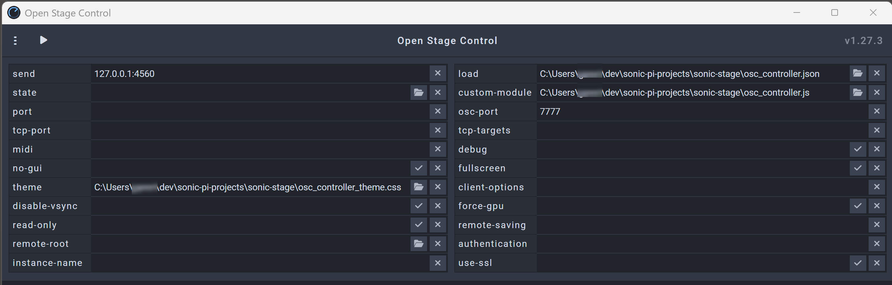

# Sonic Stage

A real-time music **performance system**. A touch/mouse UI drives a live Sonic Pi audio engine, with optional synchronized visuals — all wired together over OSC (Open Sound Control).

- 🎛️ Live control of instruments, effects, drum patterns, and tempo
- 🔊 Real-time audio generation and playback in Sonic Pi
- 🎹 MIDI input for live solo / bass / chord recording
- 🌈 Optional music-synced visuals in Processing
- 💾 Save and recall complete arrangements as JSON configs

## How it fits together


```mermaid
flowchart LR
    OSC["🎛️ Open Stage Control<br/>UI · port 7777"]
    SP["🔊 Sonic Pi<br/>Audio · port 4560"]
    PR["🌈 Processing<br/>Visuals · port 8000<br/><i>(optional)</i>"]
    OSC -- "OSC control" --> SP
    SP -- "OSC feedback" --> OSC
    SP -- "OSC drum / key" --> PR
```

| Component | Role | Listens on | Sends to |
|-----------|------|-----------|----------|
| **Open Stage Control** | User interface | `7777` | Sonic Pi `4560` |
| **Sonic Pi** | Audio engine (the runtime) | `4560` | UI `7777`, Processing `8000` |
| **Processing** *(optional)* | Visualizations | `8000` | — |

> Run every component on the **same machine** (`127.0.0.1`) for minimal latency.

## 1. Prerequisites

| Software | Min version | Download |
|----------|-------------|----------|
| **Sonic Pi** | 3.3.0 | <https://sonic-pi.net/> |
| **Open Stage Control** | 1.27 | <https://openstagecontrol.ammd.net/> |
| **Processing** *(optional)* | 4.0 | <https://processing.org/> |

If you use Processing, also install the `oscP5` and `controlP5` libraries via
**Sketch → Import Library → Manage Libraries…**

## 2. Get the code

```bash
git clone https://github.com/garenhart/sonic-stage
git clone https://github.com/garenhart/sonic-stage-visualizer   # optional, for visuals
```

```
sonic-stage/
├── sonic-stage.rb           # ← load THIS in Sonic Pi (wrapper, prevents buffer overflow)
├── osc_monitor.rb           # main engine (loaded by the wrapper)
├── osc_controller.json      # Open Stage Control layout
├── osc_controller.js        # Open Stage Control custom module
├── osc_controller_theme.css # Open Stage Control theme
├── config/                  # arrangements (_default.json is loaded on start)
└── lib/                     # Sonic Pi libraries
```

## 3. Configure

### a. Point Sonic Pi at the project (required)

Edit Sonic Pi's init file — create it if missing:

| OS | Path |
|----|------|
| macOS / Linux | `~/.sonic-pi/config/init.rb` |
| Windows | `%USERPROFILE%\.sonic-pi\config\init.rb` |

Add one line with the **absolute** path to your clone (note the trailing slash):

```ruby
set :ss_path, "/Users/username/dev/sonic-stage/"
```

> ✅ `/Users/username/dev/sonic-stage/`  &nbsp;&nbsp; ❌ `~/dev/sonic-stage/` — `~` is not expanded.

Save and **restart Sonic Pi**.

### b. Configure Open Stage Control (required)

Launch Open Stage Control and fill in these fields (paths point into your clone):

| Field | Value |
|-------|-------|
| **send** | `127.0.0.1:4560` |
| **osc-port** | `7777` |
| **load** | `…/sonic-stage/osc_controller.json` |
| **custom-module** | `…/sonic-stage/osc_controller.js` |
| **theme** | `…/sonic-stage/osc_controller_theme.css` |



### c. Configure Processing (optional)

Open a sketch from `sonic-stage-visualizer` (e.g. `keyboard_and_drums/keyboard_and_drums.pde`).
It listens on port `8000` by default — change `new OscP5(this, 8000)` only if you also change
`:anim_port` in `osc_monitor.rb`.

## 4. Run

Start the components **in this order**:

1. **Open Stage Control** — press ▶ (top-left). The launcher prints `Server started…` and a client window opens.
2. **Processing** *(optional)* — open a visualizer sketch and click **Run**.
3. **Sonic Pi** — open `sonic-stage.rb`, press **Run**.

On Run, Sonic Pi loads `config/_default.json`, populates the UI dropdowns, and starts the live
loops. Adjust anything in the Open Stage Control UI and you'll hear it change in real time.

> Load a saved arrangement from the **config** menu in the UI, or save the current one with **Save**.

## Troubleshooting

| Symptom | Fix |
|---------|-----|
| `undefined ... ss_path` / nothing loads | `:ss_path` missing or has `~`. Use a full absolute path with trailing `/`, then restart Sonic Pi. |
| UI shows but no sound / no response | Check **send** = `127.0.0.1:4560` and **osc-port** = `7777`. Confirm Open Stage Control is running *before* you press Run in Sonic Pi. |
| Empty / blank dropdowns | Re-run `sonic-stage.rb` (init runs twice on purpose to fill them). |
| No visuals | Verify `oscP5` + `controlP5` are installed and the sketch's port matches `:anim_port` (8000). |
| Port already in use | Make sure nothing else holds `7777` or `8000`. |
| Loaded `osc_monitor.rb` directly and it errored | Always load **`sonic-stage.rb`** — the wrapper avoids a buffer overflow. |

## License

MIT
